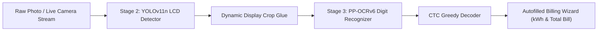

# UtilVision: In-Browser AMR Edge Vision

UtilVision is an edge-native, browser-based Automatic Meter Reading (AMR) pipeline designed for tenant-owner utility billing platforms. It runs dual deep learning models directly on the client's processor (mobile or desktop) with **zero server GPU costs, zero external API keys, 100% tenant data privacy, and offline capabilities**.

🔗 **Live Multi-Threaded WebApp (Vercel):** [https://temporary-brisk-cove-xnkgi5d.vercel.app/](https://temporary-brisk-cove-xnkgi5d.vercel.app/)  
🔗 **Fallback Static Showcase (GitHub Pages):** [https://majorpurp1e.github.io/utilvision/](https://majorpurp1e.github.io/utilvision/)

---

## ⚡ Architecture & Dual-Stage Pipeline



1. **Stage 2 (YOLOv11n - 10.6 MB):**
   - Letterboxes the frame to 640×640 and pinpoints the digital LCD counter with sub-pixel bounding box localization.
2. **Dynamic Crop Glue:**
   - Slices the active meter digits region and resizes to height 48 with aspect ratio preservation.
3. **Stage 3 (PP-OCRv6 SVTR/PPLCNet):**
   - Dual-precision edge execution:
     - **FP16 Half Precision (31 MB - Default):** Fast, lightweight, 100% decimal-point safe.
     - **FP32 Full Precision (62 MB - On-Demand):** High-precision mode downloadable on-demand.
4. **CTC Greedy Decoder:**
   - Maps raw logits into clean numeric meter readings (e.g. `020495.66`).

---

## 📱 Features

- **100% In-Browser Execution:** Powered by ONNX Runtime Web (WebAssembly SIMD). No backend server required.
- **Offline Persistent Caching:** Models are downloaded on the first visit only (`utilvision-models-v2` in `CacheStorage`). Future visits use **0 KB of network data**.
- **Mobile Camera Integration:** Automatic back-camera selection (`facingMode: { ideal: 'environment' }`) for live meter scanning.
- **Tenant Billing Wizard Integration:** Direct form field autofill calculating consumed units (kWh) and bill amount in real time.

---

## 💻 Standalone Static Deployment

This repository is self-contained. It can be hosted on GitHub Pages, Cloudflare Pages, Vercel, Netlify, or an AWS S3 bucket:

```text
├── .nojekyll
├── index.html
├── models/
│   ├── stage2.onnx        (10.6 MB)
│   ├── stage3_fp16.onnx   (31.0 MB)
│   └── stage3_fp32.onnx   (62.0 MB)
└── samples/
    └── *.jpg              (Real-world test meter photos)
```
